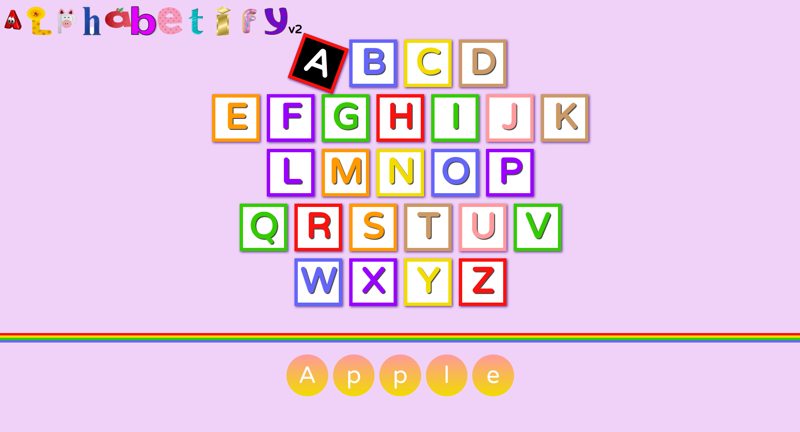

# ALPHABETIFY-V2
**An implementation of alphabet sounds with HTML/CSS/Vanilla JS**

## Getting Started
Clone or download this repository and run with a local server of open index.html with your favorite browser
 
[demo](https://alphabetifyv2.netlify.app/)

## Preview

## Features
- Produce the sound of each letter and the corresponding words on click or keyboard press
-Display the words that begin with the letter that was clicked

## Prequisite
Your browser version must be recent for a better experience
## Built with
- HTML
- CSS
- Vanilla JS
## Author
Abdulfatah Aishat aishatabdulfatah81@gmail.com 
## Addtional Info
This is one of the series of exercises for the @Codevillage-llc.
This is not meant for production. It's for learning purpose only
